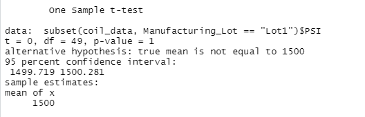
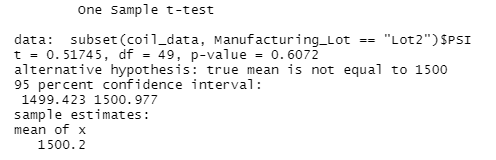
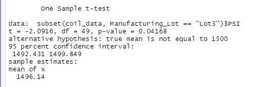

# MechaCar_Statistical_Analysis

## Background and Purpose:
AutoRus' newest prototype, the MechaCar, is suffering from production troubles that are blocking the manufacturing team's progress. 

The purpose of this analysis is to:
- perform multiple linear regression to identify which variables in the dataset predict the mpg of MechaCar's prototypes
- collect summary statistics on the pounds per square inch (PSI) of the suspension coils from the manufacturing lots 
- run t-tests to determine if the manufacturing lots are statistically different from the mean population
- to design a statistical study to compare vehicle performance of the MechaCar vehicles against vehicles from other manufacturers.

## Results
## Linear Regression to Predict MPG

 

The variables which have p-values less than the 0.05% significance level are vehicle length and ground clearance. This indicates that vehicle length and vehicle ground clearance have a significant impact on miles per gallon. The intercept also has a p-value less than 0.05 and so the intercept also accounts for some of the variance in the miles per gallon output. In contrast, the vehicle weight, spoiler alert, and AWD variables have p-values above 0.05 and so this indicates a random amount of variance with the dataset. 

The slope of the linear model is not considered to be zero. This is because the p-value for the model is 5.08e-11 which is much smaller than the significance level of 0.05%. Therefore there is sufficient evidence to reject the null hypothesis that there is no relation between the variables and explaining mpg, and thus the slope of this linear model is not zero.

Also, the linear model has an r-squared value of 0.7149, which means that approximately 71% of all mpg predictions will be determined by this model. Considering the relatively high r-squared value, the multiple regression model does predict mpg of MechaCar prototypes effectively.

## Summary Statistics on Suspension Coils

The variance of the coils is 62.29 PSI, which is well within the 100 PSI variance requirement. 

Lot 1 and Lot 2 are well within the 100 PSI variance requirement with variances of 0.98 and 7.47 respectively. However, Lot 3 has a variance of 170.29 which is much larger. A high variance value indicates that the spread of the distribution data is farther from the mean, and so future observations for Lot 3 are less likey to continue following the trend of this data. 

## T-Tests on Suspension Coils,

https://github.com/npantfoerder/mechaCar-statistical-analysis

T-tests were performed in order to determine if all manufacturing lots and each lot individually are statistically different from the population mean of 1,500 pounds per square inch. The p-value for all lots was 0.06, therefore the mean PSI of all manufacturing lots is not statistically different from the population mean. The p-values for lot 1, lot 2, and lot 3 were 1, 0.6, and 0.04 respectively. Hence, the mean PSIs of each individual lot are also not statistically different from the population mean of 1,500 PSI.

Deliverable 4:

When it comes to comparing the MechaCar to its competition, the company should consider using an ANOVA test to compare the MechaCar in various categories that customers would care about: cost, city and highway fuel efficiency, horse power, safety rating, maintenance cost. ANOVA test is able to test to see if the means from multiple different samples are significantly similar or different. This means that the averages of different cars in these categories can be compared to the average of MecaCar. If the p value is greater than 0.05, then MecaCar has the same or similar performance within these categories (the null hypothesis). If the p value is less than 0.05, then MecaCar is significantly different in those categories. If it is significant different, then looking at the average of the MecaCar is the next step. If MecaCar's average is either below or above the other averages would show how it is performing against its competitors (below = worse, above = better).
